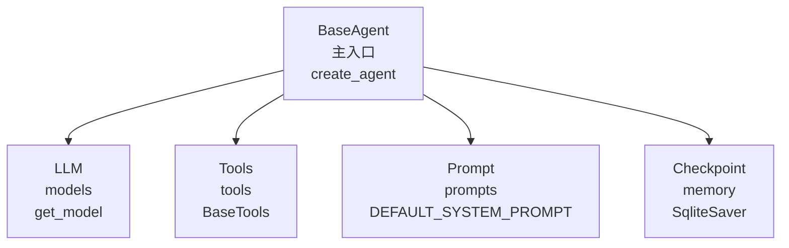
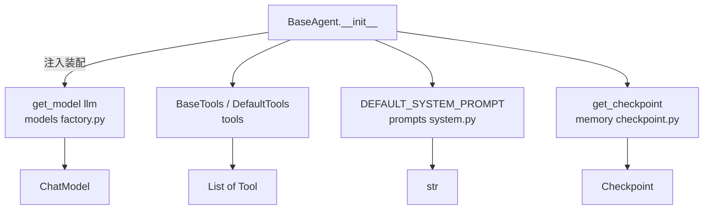
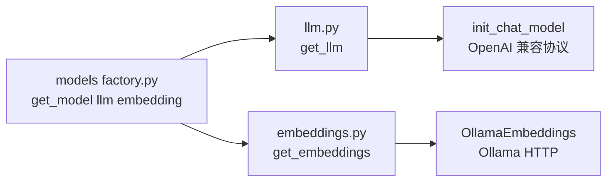
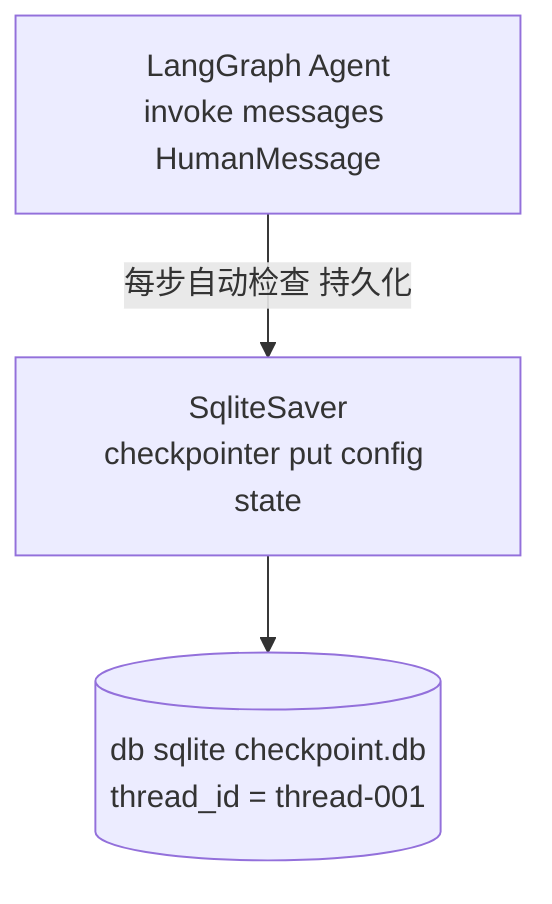
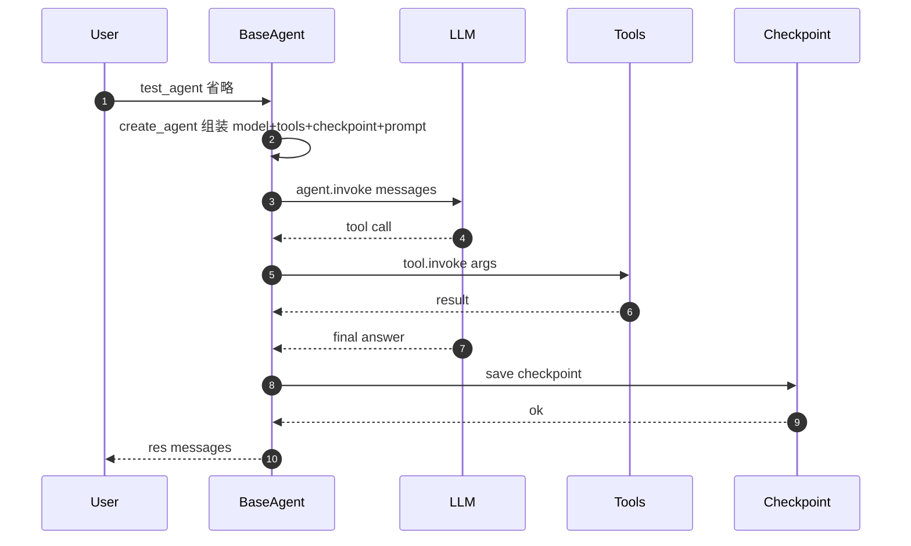

# 核心链路搭建：基于 LangGraph 的分层 Agent 工程实践

> 本文基于 `personal-knowledge-backend` 项目实际代码，记录从「一个能跑的 demo」到「可扩展的 Agent 框架」全过程的工程实现、依赖注入与分层解耦。

## 一、整体思路

核心链路 = **模型 + 工具 + 记忆 + 提示词** 四大要素的协同。LangChain / LangGraph 提供了原语，但工程上必须分层封装，避免后续 RAG、Memory、Multi-agent 接入时改动面过大。



**四大原则：**

1. **依赖注入**：BaseAgent 接收外部 tools，可替换为 RagTools / AdminTools
2. **工厂模式**：模型 / RAG 都通过 factory 创建，新增实现不改调用方
3. **抽象基类**：BaseTools / BaseRAG 留抽象方法，后续继承即可扩展
4. **关注点分离**：每个目录只负责一件事（models / tools / prompts / memory / rag）

## 二、环境准备

### 2.1 基础依赖（项目根 `pyproject.toml`）

```bash
uv add langchain langchain-openai python-dotenv langgraph langgraph-checkpoint-sqlite
```

> LLM 走 OpenAI 兼容协议，所以 `langchain-openai` 配合自定义 `base_url` 可接入 GLM / DeepSeek 等国产模型。

### 2.2 环境变量（`.env`）

```env
AUTO_MODEL_NAME=glm-5.2
AUTO_API_KEY=your_api_key
AUTO_BASE_URL=https://open.bigmodel.cn/api/paas/v4/
```

## 三、BaseAgent 四大依赖注入

### 3.1 整体架构



### 3.2 完整代码

```python
# agent/main.py
import os
from langchain.agents import create_agent
from langchain.messages import HumanMessage
from tools.base import BaseTools
from tools.default_tools import DefaultTools
from prompts.system import DEFAULT_SYSTEM_PROMPT
from models import get_model
from memory.checkpoint import get_checkpoint


class BaseAgent:
    model = None
    agent = None
    checkpointer = None
    base_tool = BaseTools()
    system_prompt = DEFAULT_SYSTEM_PROMPT

    def __init__(self, tools: BaseTools = None):
        self.model = get_model("llm")                              # ① 模型注入
        self.checkpointer = get_checkpoint()                       # ② 记忆注入
        self.tool_manager = tools if tools else DefaultTools()     # ③ 工具注入
        # self.system_prompt 已通过类属性注入                       # ④ 提示词注入

    def create_agent(self):
        return create_agent(
            model=self.model,
            system_prompt=self.system_prompt,
            tools=self.tool_manager.get_tools(),
            checkpointer=self.checkpointer,
        )

    def test_agent(self, message: str):
        agent = self.create_agent()
        config = {
            "configurable": {
                "thread_id": "thread-001",
                "checkpoint_ns": "research_subgraph",
            }
        }
        res = agent.invoke({"messages": [HumanMessage(message)]}, config=config)
        for msg in res["messages"]:
            msg.pretty_print()
        return res


if __name__ == "__main__":
    agent_init = BaseAgent()
    agent_init.test_agent("北京明天天气怎么样")
```

> **关键点**：四大依赖都是「延迟注入」——不在 `__init__` 时立刻调用模型/工具，只持有引用，调用 `create_agent()` 时才组合。

## 四、提示词抽离：`prompts/system.py`

**为什么抽离？**

- 提示词是产品策略，会频繁迭代，不应该埋在业务代码里
- 多场景（聊天 / 总结 / 翻译）需要不同提示词，分文件管理更清晰

```python
# agent/prompts/system.py
DEFAULT_SYSTEM_PROMPT = """
你是一个严谨、高效、智能的个人知识库助手。
你的核心职责是基于用户提供的个人知识库（文档、笔记、片段等）内容，
准确回答用户的问题、提取关键信息、总结提炼内容。
你不仅是知识的检索者，更是用户的智囊。
"""
```

使用：

```python
from prompts.system import DEFAULT_SYSTEM_PROMPT

agent = BaseAgent()
agent.system_prompt = CUSTOM_PROMPT      # 运行时替换
```

## 五、模型抽离：`models/factory.py`

**为什么用工厂？**

支持多家 LLM（OpenAI / GLM / DeepSeek）时，调用方不应该关心具体实现。`get_model("llm")` 返回的对象对外接口统一（`invoke` / `stream` / `bind_tools`）。



```python
# agent/models/llm.py
from langchain.chat_models import init_chat_model
from .config import ModelConfig

def get_llm(temperature: float = None):
    return init_chat_model(
        model=ModelConfig.LLM_MODEL_NAME,
        model_provider="openai",
        base_url=ModelConfig.LLM_BASE_URL,
        api_key=ModelConfig.LLM_API_KEY,
        temperature=temperature or ModelConfig.LLM_TEMPERATURE,
    )
```

```python
# agent/models/factory.py
from .llm import get_llm
from .embeddings import get_embeddings

def get_model(model_type: str = None, **kwargs):
    model_type = (model_type or os.getenv("MODEL_TYPE", "llm")).lower()
    if model_type in ("llm", "chat"):
        return get_llm(temperature=kwargs.pop("temperature", None))
    if model_type in ("embedding", "embeddings", "vector"):
        return get_embeddings()
    raise ValueError(f"未知的模型类型: {model_type}")
```

> BaseAgent 中调用 `get_model("llm")`，未来切换 DeepSeek 只需在 `llm.py` 改一行 `model=...`，调用方零改动。

## 六、工具抽离：`tools/base.py` + `tools/default_tools.py`

**为什么拆 `BaseTools`？**

- 避免把 `tools=[get_weather]` 这种「具体业务」写在 `main.py`
- 支持多套工具集（DefaultTools / RagTools / AdminTools），运行时切换
- 测试时可以用 `MockTools()` 替换，避免调用真实接口

### 6.1 抽象基类

```python
# agent/tools/base.py
from typing import List
from langchain_core.tools import BaseTool

class BaseTools:
    """
    工具集基类。
    所有的工具集合都应该继承这个类，并重写 get_tools 方法。
    """
    def __init__(self):
        pass

    def get_tools(self) -> List[BaseTool]:
        return []
```

### 6.2 默认工具集

```python
# agent/tools/default_tools.py
from tools.base import BaseTools
from tools.get_weather import get_weather

class DefaultTools(BaseTools):
    def __init__(self):
        super().__init__()

    def get_tools(self):
        return [
            get_weather,
            # future: search_knowledge_tool
        ]
```

### 6.3 灵活组合

```python
# 场景 1：默认工具
agent = BaseAgent()

# 场景 2：自定义 RAG 工具集
agent = BaseAgent(tools=RagTools())

# 场景 3：测试用 Mock
agent = BaseAgent(tools=MockTools())
```

### 6.4 单个工具示例

```python
# agent/tools/get_weather.py
from langchain.tools import tool

@tool
def get_weather(city: str) -> str:
    """根据城市获取天气"""
    return f"明天{city}，天气是雨天"
```

> `@tool` 装饰器是 LangChain 的约定，会自动从签名/文档生成 Tool 描述，喂给模型让其决定何时调用。

## 七、记忆抽离：`memory/checkpoint.py`

**为什么需要 Checkpoint？**

LangGraph 是有状态图，每轮对话的状态（消息历史、中间变量）需要持久化，否则：

- 多轮上下文断片（Agent 忘了之前说过什么）
- 程序挂了模型丢失会话
- 无法做时间旅行 / 回放调试



### 7.1 完整代码

```python
# agent/memory/checkpoint.py
import sqlite3
import os
from langgraph.checkpoint.sqlite import SqliteSaver

def get_db_url():
    current_path = os.path.dirname(__file__)
    BASE_DIR = os.path.dirname(os.path.dirname(current_path))
    DB_DIR = os.path.join(BASE_DIR, "db", "sqlite")
    return os.path.join(DB_DIR, "checkpoint.db")

def get_checkpoint():
    db_url = get_db_url()
    checkpointer = SqliteSaver(sqlite3.connect(db_url, check_same_thread=False))
    checkpointer.setup()
    return checkpointer
```

### 7.2 thread_id 隔离会话

```python
config = {
    "configurable": {
        "thread_id": "thread-001",          # 会话 ID
        "checkpoint_ns": "research_subgraph"  # 命名空间
    }
}
```

不同 `thread_id` 的对话状态完全隔离：

```text
thread-001  →  "我叫小黑"          →  Agent 记住名字
thread-002  →  "请说出我的名字"    →  Agent 不认识（独立上下文）
```

## 八、完整调用链路时序图



## 九、最佳实践清单

1. **依赖注入**：BaseAgent 通过 `__init__(tools=...)` 接收外部能力，避免硬编码
2. **工厂模式**：`models/factory.py` 统一创建模型，新增 LLM 不改调用方
3. **抽象基类**：`BaseTools` / `BaseRAG` 留抽象方法，预留扩展点
4. **关注点分离**：每个目录只负责一件事（models / tools / prompts / memory / rag）
5. **路径集中**：DB 路径、向量库路径、checkpoint 路径都通过 `os.path` 推导而非硬编码

## 十、后续规划

| 优先级 | 功能 | 收益 |
| --- | --- | --- |
| ⭐⭐⭐ | `RagTools` 接入 RAG 检索 | 让 Agent 能查个人知识库 |
| ⭐⭐⭐ | 多 thread_id 会话管理 | 多用户/多会话隔离 |
| ⭐⭐ | `MultiAgent` 子图编排 | 复杂任务拆分 |
| ⭐⭐ | 流式输出 + WebSocket | 实时返回 |
| ⭐ | LangSmith 追踪 | 可观测性 |
| ⭐ | 模型路由（Router） | 按场景选 LLM |

**附：5 分钟跑起来**

```bash
# 1. 安装依赖
uv add langchain langchain-openai python-dotenv langgraph langgraph-checkpoint-sqlite

# 2. 配置 .env
echo "AUTO_MODEL_NAME=glm-5.2" > .env
echo "AUTO_API_KEY=xxx" >> .env
echo "AUTO_BASE_URL=https://open.bigmodel.cn/api/paas/v4/" >> .env

# 3. 跑通
uv run agent/main.py
```

从环境变量到一个能记多轮对话的 Agent，整个核心链路不超过 60 行代码——这就是 LangGraph + 分层封装带来的工程红利。