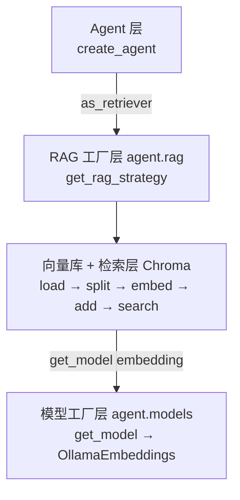
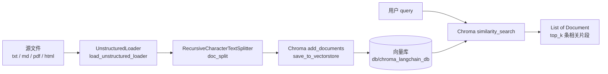

# RAG 链路搭建：从文档到问答的完整工程实践

> 本文基于 `personal-knowledge-backend` 项目实际代码，记录从「零散文档」到「Agent 可挂载的 RAG 工具」全过程的工程实现、关键决策与踩坑经验。

## 一、整体架构

RAG（Retrieval-Augmented Generation）链路的核心思想是：**让大模型在回答之前，先从私有知识库中检索相关内容作为上下文**。本项目将链路拆分为四层：



四层各司其职，新增一种 RAG 策略只需新增一个实现类，无需改动 Agent 层。

## 二、Embedding 模型接入：Ollama + Qwen

### 2.1 选型理由

| 方案 | 优点 | 缺点 |
| --- | --- | --- |
| OpenAI Embedding | 效果稳定 | 需要外网 + API Key，费用高 |
| 本地 Sentence-Transformers | 完全离线 | 需要手写 LangChain 适配 |
| **Ollama + Qwen3-Embedding** | **本地推理 + LangChain 原生支持 + 中英文友好** | 需要本地起 Ollama 服务 |

最终选用 `qwen3-embedding:0.6b`，体积小、速度快、维度可控。

### 2.2 配置中心

把所有环境变量集中到 `ModelConfig`，避免散落在各处：

```python
# agent/models/config.py
class ModelConfig:
    LLM_MODEL_NAME       = os.getenv("AUTO_MODEL_NAME", "glm-5.2")
    LLM_API_KEY          = os.getenv("AUTO_API_KEY")
    LLM_BASE_URL         = os.getenv("AUTO_BASE_URL")
    LLM_TEMPERATURE      = 0.7

    EMBEDDING_MODEL_NAME = os.getenv("EMBEDDING_MODEL_NAME", "qwen3-embedding:0.6b")
    EMBEDDING_DIMENSIONS = int(os.getenv("EMBEDDING_DIMENSIONS", 1024))

    OLLAMA_BASE_URL      = os.getenv("OLLAMA_BASE_URL", "http://localhost:11434")
```

> **注意**：Embedding 和 LLM 的 `BASE_URL` 是分开的——Embedding 走本地 Ollama，LLM 走云端 API，这是项目里一个常见困惑点。

### 2.3 工厂函数封装

```python
# agent/models/embeddings.py
def get_embeddings():
    return OllamaEmbeddings(
        model=ModelConfig.EMBEDDING_MODEL_NAME,
        base_url=ModelConfig.OLLAMA_BASE_URL,
        dimensions=ModelConfig.EMBEDDING_DIMENSIONS,
    )
```

## 三、统一模型入口：工厂模式

### 3.1 为什么需要模型工厂

随着项目演进，可能要支持多家 LLM（OpenAI / GLM / DeepSeek）、多种 Embedding（Ollama / OpenAI / BGE）。如果每个调用方都 `from xxxx import ...`，切换成本极高。

### 3.2 `get_model` 统一入口

```python
# agent/models/factory.py
def get_model(model_type: str = None, **kwargs):
    model_type = (model_type or os.getenv("MODEL_TYPE", "llm")).lower()

    if model_type in ("llm", "chat"):
        temperature = kwargs.pop("temperature", None)
        return get_llm(temperature=temperature)

    elif model_type in ("embedding", "embeddings", "vector"):
        return get_embeddings()

    raise ValueError(f"未知的模型类型: {model_type}")
```

调用方只关心字符串标识：

```python
from models import get_model

llm       = get_model("llm", temperature=0.5)
embedding = get_model("embedding")
```

`agent/main.py` 和 `agent/rag/vector.py` 均改为通过工厂函数获取模型，不再直接 `from models.llm import get_llm`，避免硬编码依赖。

## 四、文档加载：UnstructuredLoader

知识库来源多样（txt / md / pdf / html），手写每种格式的解析器不现实。`unstructured` 库提供统一的文档加载接口：

```python
# agent/rag/vector.py
@staticmethod
def load_unstructured_loader(file_path):
    loader = UnstructuredLoader(file_path=file_path, strategy="fast")
    docs = loader.load()
    print(f"加载了 {len(docs)} 个文档")
    return docs
```

- `strategy="fast"`：速度快，适合纯文本；需要 OCR/表格识别可改为 `"hi_res"`。

## 五、文档切分：RecursiveCharacterTextSplitter

长文档直接送进 Embedding 会丢上下文、切分粒度太细又会破坏语义。LangChain 的 `RecursiveCharacterTextSplitter` 是工业级默认选择：

```python
text_splitter = RecursiveCharacterTextSplitter(
    chunk_size=100,        # 每个块 100 字符（项目里偏小，可按需调到 500）
    chunk_overlap=0,       # 无重叠（生产环境建议 50~100）
)
chunks = text_splitter.split_documents(docs)
```

切分后立即给每个 chunk 打 ID + 元数据，方便后续去重和溯源：

```python
for i, c in enumerate(chunks):
    c.id = f"doc_{i + 1}"
    c.metadata["id"]       = c.id
    c.metadata["filename"] = filename
```

> **关键点**：`doc_split` 同时返回 `(chunks, ids)` 元组，避免调用方把「文档列表」和「ID 列表」混为一谈——这是真实开发中极易踩的坑。

## 六、向量库：Chroma 持久化

### 6.1 为什么选 Chroma

| 选型 | 适用场景 |
| --- | --- |
| **Chroma** | 本地小规模、零运维、LangChain 一等公民 |
| FAISS | 高性能纯向量检索，无元数据过滤 |
| Milvus / Weaviate | 分布式、生产级 |
| Pinecone | SaaS，省心但收费 |

个人知识库场景下数据量小（万级以内），Chroma 是最省心的选择。

### 6.2 延迟初始化

向量库初始化比较重（要建索引），用 `@property` 延迟到首次使用：

```python
class VectorRAG:
    def __init__(self, persist_directory=None):
        self.persist_directory = persist_directory or os.getenv(
            "CHROMA_PERSIST_DIR", "./db/chroma_langchain_db"
        )
        self.collection_name = os.getenv("CHROMA_COLLECTION_NAME", "default_collection")
        self._vectorstore = None

    @property
    def vectorstore(self) -> Chroma:
        if self._vectorstore is None:
            self._vectorstore = Chroma(
                collection_name=self.collection_name,
                embedding_function=get_model("embedding"),
                persist_directory=self.persist_directory,
            )
        return self._vectorstore
```

### 6.3 完整 CRUD

```python
def save_to_vectorstore(self, documents, ids=None):
    self.vectorstore.delete(ids)              # 先按 id 去重，避免重复入库
    self.vectorstore.add_documents(documents, ids=ids)

def similarity_search(self, query, top_k=5):
    return self.vectorstore.similarity_search(query, k=top_k)

def similarity_search_with_score(self, query, top_k=5):
    return self.vectorstore.similarity_search_with_score(query, k=top_k)

def as_retriever(self, top_k=5):
    return self.vectorstore.as_retriever(search_kwargs={"k": top_k})

def delete_collection(self):
    self.vectorstore.delete_collection()
    self._vectorstore = None

def get_collection_count(self) -> int:
    return self.vectorstore._collection.count()
```

### 6.4 RAG 工厂

```python
# agent/rag/factory.py
def get_rag_strategy(config: dict) -> BaseRAG:
    rag_type = config.get("RAG_TYPE", "vector")
    if rag_type == "vector":
        persist_directory = config.get(
            "VECTOR_DB_PATH",
            os.getenv("CHROMA_PERSIST_DIR", "./db/chroma_langchain_db"),
        )
        return VectorRAG(persist_directory=persist_directory)
    elif rag_type == "hybrid":
        # return HybridRAG(...)  # TODO
        pass
    raise ValueError(f"未知的 RAG 类型: {rag_type}")
```

`BaseRAG` 抽象基类预留了 `retrieve()` 和 `to_tool()` 接口，未来接入 Hybrid / BM25 / ReRank 时只需新增实现类，不影响上层。

## 七、完整入库与检索流程图



## 八、挂载到 LangChain Agent

RAG 链路最终要回归到 Agent。`as_retriever()` 把 Chroma 包装成 LangChain 标准 `Retriever`：

```python
rag = VectorRAG(persist_directory="./db/chroma_langchain_db")
retriever = rag.as_retriever(top_k=5)

# 方式 1：直接挂到 Agent tools（适合 LangGraph create_agent）
agent = create_agent(
    model=get_model("llm"),
    tools=[rag_retriever_tool],   # 通过 to_tool() 封装
    checkpointer=...,
)
```

后续会在 `VectorRAG.to_tool()` 中实现「自定义 Tool」，让模型自主决定何时检索。

## 九、踩坑记录

### 9.1 `sys.path` 不在项目根

`agent/rag/vector.py` 顶层用 `from models import get_model`，依赖 `agent/` 在 `sys.path` 里。直接 `python agent/rag/vector.py` 启动时，Python 只把脚本所在目录加到 `sys.path`，找不到 `models`。

**解决**：脚本顶部手动注入：

```python
import sys, os
_agent_dir = os.path.dirname(os.path.dirname(os.path.abspath(__file__)))
if _agent_dir not in sys.path:
    sys.path.insert(0, _agent_dir)
```

### 9.2 文档 vs ID 混用

最初 `doc_split` 只返回 `ids`，调用方误以为是 chunks 传给 `add_documents`，触发 `AttributeError: 'str' object has no attribute 'page_content'`。

**解决**：明确返回 `(chunks, ids)` 元组，强制调用方解包。

### 9.3 Embedding 与 LLM 的 BASE_URL 不同

Embedding 走本地 Ollama（`http://localhost:11434`），LLM 走云端 API（`AUTO_BASE_URL`）。如果混用，Embedding 会指向云端，但 Ollama 模型不在那里，会一直报错。

**解决**：在 `ModelConfig` 中明确分离 `OLLAMA_BASE_URL` 和 `LLM_BASE_URL`。

### 9.4 Chroma 重复添加不会覆盖

Chroma 默认是「追加」语义，同一文件多次入库会重复。生产环境必须先 `delete(ids)` 再 `add`。

### 9.5 `chunk_size` 太小的代价

项目里默认 `chunk_size=100`，太细会导致上下文碎片化，检索召回率高但准确率低。生产环境建议 `300~800` 字符，`chunk_overlap=50~100`。

## 十、最佳实践清单

1. **配置集中化**：所有模型/向量库参数走环境变量 + `ModelConfig`，避免散落
2. **工厂模式分两层**：`models/factory.py` 管模型，`rag/factory.py` 管 RAG 策略
3. **延迟初始化**：向量库、Embedding 都用 `@property` 包一层，重资源用到再创建
4. **ID 与内容分离**：API 层面用 `(chunks, ids)` 元组，杜绝类型混淆
5. **抽象基类预留扩展**：`BaseRAG` 留 `retrieve` 和 `to_tool` 抽象方法，后续 Hybrid/ReRank 直接继承即可

## 十一、后续规划

| 优先级 | 功能 | 收益 |
| --- | --- | --- |
| ⭐⭐⭐ | `VectorRAG.to_tool()` 实现 LangChain Tool | 让 Agent 自主决定何时检索 |
| ⭐⭐⭐ | 接入 BGE / M3E Embedding | 提升中文检索质量 |
| ⭐⭐ | Hybrid Search（向量 + BM25） | 缓解专有名词召回差 |
| ⭐⭐ | Rerank（bge-reranker / cohere） | 检索后精排，准确率显著提升 |
| ⭐ | PDF / HTML / 图片多模态入库 | 扩展知识库来源 |
| ⭐ | 增量更新：监控文件夹变化自动入库 | 解放人工 |

**附：完整调用流程**

```python
from agent.rag import VectorRAG

rag = VectorRAG(persist_directory="./db/chroma_langchain_db")

# 1) 入库
docs   = VectorRAG.load_unstructured_loader("知识库/html常用技巧.txt")
chunks, ids = VectorRAG.doc_split(docs, filename="html常用技巧.txt")
rag.save_to_vectorstore(chunks, ids=ids)

# 2) 检索
results = rag.similarity_search("如何实现弹性布局？", top_k=3)
for doc in results:
    print(doc.page_content)
```

从 `txt` 文件到可检索的向量库，整个链路不超过 30 行代码——这就是分层工厂模式 + LangChain 生态带来的工程红利。